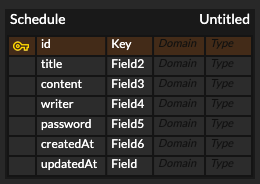

# API 명세서

---

## 📍일정 생성 (Create)
- Method: `POST`
- URL: `/schedules`

### Request Body
```
{
    "title": "일정제목",
    "content": "일정내용",
    "writer": "작성자명",
    "password": "비밀번호",
    "createdAt": "작성일",
    "updatedAt": "수정일"
}
```
### Response
```
{
    "id": 작성id,
    "title": "일정제목",
    "content": "일정내용",
    "writer": "작성자명",
    "createdAt": "작성일",
    "updatedAt": "수정일"
}
```

## 📍일정 조회 (Read)

### 전체 일정 조회 Response
- Method: `GET`
- URL: `/schedules`
```
{
    "id": 작성id,
    "title": "일정제목",
    "content": "일정내용",
    "writer": "작성자명",
    "createdAt": "작성일",
    "updatedAt": "수정일"
}
```
### 선택 일정 조회 Response
- Method: `GET`
- URL: `/schedules/{scheduleId}`
```
{
    "id": 작성id,
    "title": "일정제목",
    "content": "일정내용",
    "writer": "작성자명",
    "createdAt": "작성일",
    "updatedAt": "수정일"
}
```

## 📍일정 수정 (Update)
- Method: `PUT`
- URL: `/schedules/{scheduleId}`
### Request Body
```
{
    "title": "일정제목",
    "content": "일정내용",
    "writer": "작성자명",
    "updatedAt": "수정일"
}
```
### Response
```
{
    "id": 작성id,
    "title": "일정제목",
    "content": "일정내용",
    "writer": "작성자명",
    "createdAt": "작성일",
    "updatedAt": "수정일"
}
```

## 📍일정 삭제 (Delete)
- Method: `DELETE`
- URL: `/schedules/{scheduleId}`
### Request Body
```
{
  "password": "1234"
}
```
### Response
```
{
    "message": "삭제완료"
}
```

---

# ERD

---

